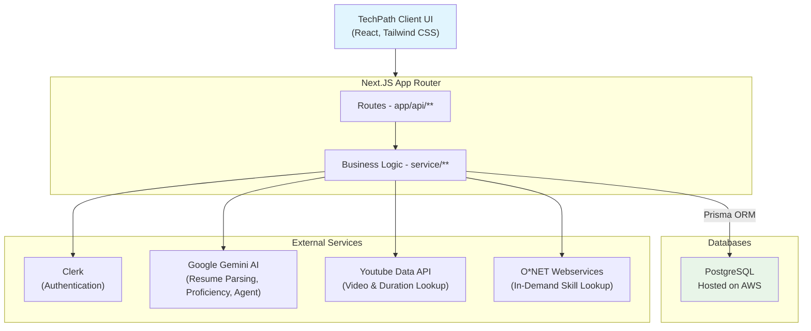

# TechPath - AI-Powered Tech Career Guidance Platform

[](https://nextjs.org/)
[](https://reactjs.org/)
[](https://www.typescriptlang.org/)
[](https://www.postgresql.org/)
[](https://clerk.com/)

## 📋 Table of Contents

- [Overview](#overview)
- [Authors](#authors)
- [Features](#features)
- [Architecture](#architecture)
- [Tech Stack](#tech-stack)
- [Prerequisites](#prerequisites)
- [Installation](#installation)
- [Environment Variables](#environment-variables)
- [Usage](#usage)
- [API Documentation](#api-documentation)
- [Testing](#testing)
- [Deployment](#deployment)
- [Contributing](#contributing)
- [Acknowledgments](#acknowledgments)

## 🧭 Overview

TechPath is an AI-powered career guidance platform that helps users **find their best-fit tech career role**. A user signs in, uploads a resume, and TechPath uses generative AI to parse it into a structured profile (education, experience, projects, skills). From there, the user lands in a personalized workspace where they can:

- Browse a **Landscape** of tech roles, each scored against their own skill set
- Chat with an **AI career-coach agent** that can inspect and update their profile, recommend roles/courses, and pull in live job listings
- Work through **Grind**, a queue of learning resources (courses, YouTube videos) targeted at the skill gaps between their profile and a chosen "dream role"

### Key Capabilities

- **AI Resume Parsing**: Upload a PDF/DOCX resume and have it parsed into structured profile data
- **Role Match Scoring**: 0–100 match scores per role, computed from weighted skill overlap
- **AI Career Agent**: A tool-calling chat agent that can edit the user's profile, recommend roles/courses, and search live job listings
- **Skill-Gap Learning Recommendations**: Courses and videos ranked by relevance to a user's target role
- **Skill Proficiency Ratings**: AI-generated proficiency scores and rationale per skill/role
- **External Data Integrations**: O*NET (in-demand technologies), YouTube Data API (learning videos), JSearch/Adzuna (live job listings)

## 👥 Authors

* **Roy Hung** – [GitHub](https://github.com/royshunhung)
* **Sandy Feng** – [GitHub](https://github.com/sandyfffeng)
* **Ellie Hou** – [GitHub](https://github.com/elliehou666)
* **Kevin Yang** – [GitHub](https://github.com/kevinyang44)

## ✨ Features

### 🎯 Core Features

- **Authentication**: Clerk-based sign-in, synced into the local database via `/api/users/sync`
- **Resume Upload & AI Parsing**: PDF/DOCX resumes parsed into structured data (`app/actions/resume.ts`) using `unpdf`/`mammoth` + Google Generative AI
- **Resume Review**: Edit AI-parsed resume fields (education, experience, projects) before saving as a profile
- **Role Landscape**: Browse roles with AI-computed match scores, view role detail, and set a "dream role"
- **AI Career Agent**: Persisted chat conversations with a tool-calling agent (`services/agent.ts`)
- **Grind**: Personalized learning resources (courses + YouTube videos) targeting skill gaps, with saved/in-progress/completed status tracking
- **Profile Editing**: Update saved profile details after onboarding

### 📊 Analytics & Matching Features

- **Match Scoring**: Role-fit scores from weighted skill comparison (`services/match.ts`)
- **Skill Proficiency Ratings**: Cached AI-rated proficiency + rationale per profile/role/skill
- **Hot Technology Lookup**: O*NET integration surfaces in-demand technologies not yet in the internal skill catalog (`services/onet.ts`)
- **Live Job Search**: Job listings via JSearch/Adzuna (`services/jobs.ts`)

## 🏗️ Architecture

### High-Level Architecture

The app is a single Next.js project — there is no separate backend service. Route handlers under `app/api/**` and server actions under `app/actions/**` call into domain logic in `services/**`, which reads/writes PostgreSQL through Prisma (`lib/db.ts`).



### Component Structure

- **`app/(workspace)`**: auth+profile-gated shell (`layout.tsx`) with the `landscape`, `agent`, `grind`, and `profile` pages, plus shared nav (`components/workspace/WorkspaceShell.tsx`) and profile context (`components/workspace/WorkspaceProfileProvider.tsx`)
- **`app/resume-upload` / `app/resume-review`**: onboarding flow prior to having a profile
- **`app/sign-in` / `app/sign-up`**: Clerk-hosted auth (sign-up folds into the sign-in flow)
- **`app/api/**`**: REST route handlers, auto-documented via Swagger (see [API Documentation](#api-documentation))
- **`app/actions/**`**: server actions for resume parsing and skill-proficiency rating
- **`services/**`**: domain logic (profiles, roles, skills, matching, resources, resumes, conversations, agent, onet, video, jobs, users) — this is where most business logic lives, kept separate from route handlers
- **`prisma/schema.prisma`**: data model — `Role`, `Skill`, `Profile`, `User`, `Resume`, `Conversation`, `ProfileSkillRating`, plus join tables for role/resource skill weighting and course/resource tracking

### A note on `frontend/` vs `ui/figma/`

This repo contains **two** UI-related directories that are easy to confuse:

- **`ui/figma/`** is the code that actually ships — adapted Figma-generated components imported throughout `app/` (and previewable standalone at `/figma-preview`).
- **`frontend/`** is the *raw, original* Figma Make export (its own standalone Vite + React project, with its own `package.json`/`pnpm-workspace.yaml`). It is **not** imported anywhere in the Next.js app and does **not** need to be installed or run separately — it's kept only as the original design source.

## 🛠️ Tech Stack

### Frontend
- **React 19.2.4** with the **Next.js 16** App Router (also serves as the backend)
- **TypeScript**
- **Tailwind CSS v4**
- **react-markdown** + **remark-breaks**: rendering agent chat responses
- **lucide-react**: icons

### Backend
- **Next.js Route Handlers** (`app/api/**`) and **Server Actions** (`app/actions/**`)
- **Prisma 7** with **`@prisma/adapter-pg`** over a native **`pg`** connection pool
- **PostgreSQL**
- **Clerk** (`@clerk/nextjs`): authentication, enforced via `proxy.ts` middleware
- **`ai` + `@ai-sdk/google`**: Google Generative AI integration for resume parsing and the career agent
- **`googleapis`** (`@googleapis/youtube`): YouTube Data API integration
- **`unpdf`** / **`mammoth`**: PDF/DOCX text extraction
- **`zod`**: schema validation for AI outputs
- **`next-swagger-doc`** + **`swagger-ui-react`**: auto-generated API docs

## 📋 Prerequisites

- **Node.js**: version pinned by [`.nvmrc`](.nvmrc) (`lts/*`)
- **npm**
- **PostgreSQL**: a reachable instance (the connection pool is configured for TLS with `rejectUnauthorized: false`, suitable for AWS RDS-style certs)
- **Clerk** account (publishable + secret key)
- **Google Generative AI** API key (resume parsing + career agent)
- **YouTube Data API** key
- Optional, feature-specific: **JSearch** (RapidAPI) and/or **Adzuna** API credentials for live job search, and an **O*NET Web Services** API key for hot-technology lookups

## 🚀 Installation

### 1. Clone the Repository

```bash
git clone git@github.com:TechPath-MCIT/TechPath.git
cd TechPath
```

### 2. Install Dependencies

```bash
npm ci
```

`postinstall` automatically runs `prisma generate`.

### 3. Configure Environment Variables

Create a `.env.local` file in the project root (see [Environment Variables](#environment-variables) for the full list).

### 4. Sync the Database Schema

The project has no `prisma/migrations` directory — schema changes are applied directly:

```bash
npx prisma db push
```

## 🔑 Environment Variables

Set these in `.env.local`.

#### Required

| Variable | Used by | Purpose |
|---|---|---|
| `DATABASE_URL` | Prisma CLI (`prisma.config.ts`) | Connection string used for `prisma generate` / `prisma db push` |
| `DB_HOST`, `DB_PORT`, `DB_NAME`, `DB_USER`, `DB_PASSWORD` | App runtime (`lib/db.ts`) | Granular Postgres connection params used by the `pg` pool at runtime |
| `CLERK_SECRET_KEY` | `@clerk/nextjs` | Server-side Clerk authentication |
| `NEXT_PUBLIC_CLERK_PUBLISHABLE_KEY` | `@clerk/nextjs` | Client-side Clerk authentication |
| `GOOGLE_GENERATIVE_AI_API_KEY` | `app/actions/resume.ts`, `services/agent.ts` | Resume parsing and the AI career agent |
| `YOUTUBE_API_KEY` | `services/video.ts` | Fetching learning videos for the Grind page |

#### Optional (feature-specific)

| Variable | Used by | Purpose |
|---|---|---|
| `JSEARCH_API_KEY` | `services/jobs.ts` | Live job search via the JSearch (RapidAPI) API |
| `ADZUNA_APP_ID`, `ADZUNA_APP_KEY` | `services/jobs.ts` | Live job search via the Adzuna API |
| `ONET_API_KEY` | `services/onet.ts` | O*NET hot-technology lookups |

## 🎯 Usage

### Development Mode

```bash
npm run dev
```

Open [http://localhost:3000](http://localhost:3000).

### User Flow

1. **Sign in** — unauthenticated visitors are routed to `/sign-in` (Clerk)
2. **Upload a resume** — first-time users without a profile are routed to `/resume-upload`
3. **Review** — the AI-parsed resume is editable at `/resume-review` before it's saved as a profile
4. **Workspace** — once a profile exists, the user lands in the workspace:
   - **Landscape** (`/landscape`) — browse roles with match scores, set a dream role
   - **Agent** (`/agent`) — chat with the AI career coach
   - **Grind** (`/grind`) — work through recommended courses and videos
   - **Profile** (`/profile`) — edit saved profile details

### Production Mode

```bash
npm run build
npm start
```

## 📚 API Documentation

Interactive Swagger UI (OpenAPI 3.0, generated via `next-swagger-doc` from `app/api/**` — see `lib/swagger.ts`) is served at:

```
http://localhost:3000/api/api-doc
```

### Endpoint Groups

```bash
# Profiles
GET/POST   /api/profiles
GET/PUT    /api/profiles/[id]
GET/PUT    /api/profiles/[id]/location
GET/PUT    /api/profiles/[id]/role
GET        /api/profiles/[id]/role/name
GET        /api/profiles/[id]/role/skills
GET        /api/profiles/[id]/role/[roleId]/skill-ratings
GET/PUT    /api/profiles/[id]/skills
GET/PUT    /api/profiles/[id]/resources
GET        /api/profiles/[id]/resume
GET        /api/profiles/[id]/resume/context
GET        /api/profiles/[id]/match
POST       /api/profiles/[id]/agent
GET/PUT/DELETE /api/profiles/[id]/conversations
GET        /api/profiles/[id]/conversations/latest

# Roles & Skills
GET        /api/roles
GET        /api/skills
GET        /api/skills/[name]

# Resources & Video
GET        /api/resources
GET        /api/outside-courses
GET/POST   /api/video/[roleid]/[skillid]

# Resumes
POST       /api/resumes/parse

# Users
GET        /api/users/me
GET        /api/users/sync

# Utility
GET        /api/db-test
```

## 🧪 Testing

There is no Jest/Vitest suite configured. Instead, `app/tests/` contains standalone `ts-node` scripts with fixtures in `app/tests/test_resumes/`:

```bash
npx ts-node app/tests/skills-test.ts
npx ts-node app/tests/match-test.ts
npx ts-node app/tests/resume_test.ts
```

## 🚀 Deployment

TechPath is a standard Next.js app, so [Vercel](https://vercel.com/) is the simplest deployment target:

1. Push the repository to GitHub and import it into a new Vercel project
2. Set all [required environment variables](#environment-variables) (and any optional ones for job search/O*NET) in the Vercel project settings
3. Point `DATABASE_URL`/`DB_*` at a reachable, publicly-accessible PostgreSQL instance — the connection pool in `lib/db.ts` is configured with `ssl: { rejectUnauthorized: false }` for RDS-style certificates
4. Deploy — Vercel runs `npm ci` (which triggers `prisma generate` via `postinstall`) followed by `npm run build`

## 🤝 Contributing

### Development Workflow

1. **Create a feature branch**
   ```bash
   git checkout -b feature/your-feature-name
   ```
2. **Make your changes**
3. **Run the test scripts relevant to your change** (see [Testing](#testing))
4. **Commit your changes** using [Conventional Commits](https://www.conventionalcommits.org/), matching this repo's existing history:
   ```bash
   git commit -m "feat: add new search functionality"
   git commit -m "fix: resolve database connection issue"
   ```
5. **Push and open a Pull Request**
   ```bash
   git push origin feature/your-feature-name
   ```

## 🙏 Acknowledgments

### Design Source

The workspace UI (`ui/figma/`, adapted from the original export in `frontend/`) was generated with Figma Make and includes components from [shadcn/ui](https://ui.shadcn.com/) (MIT licensed) and photos from [Unsplash](https://unsplash.com).

### External Services & APIs

- **[Clerk](https://clerk.com/)**: authentication
- **[Google Generative AI](https://ai.google.dev/)**: resume parsing and the AI career agent
- **[YouTube Data API](https://developers.google.com/youtube/v3)**: learning video recommendations
- **[O*NET Web Services](https://services.onetcenter.org/)**: in-demand technology data
- **[JSearch](https://rapidapi.com/letscrape-6bRBa3QguO5/api/jsearch)** / **[Adzuna](https://developer.adzuna.com/)**: live job listings
